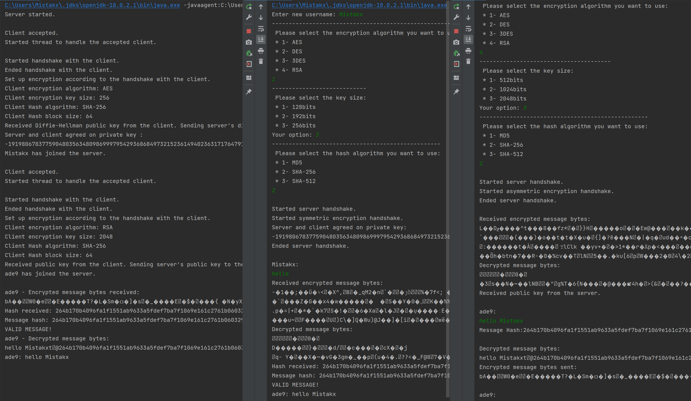

Encrypted chat built as the second project of the Advanced Programming class, implemented using symmetric and asymmetric key encryption algorithms like RSA and AES with various key sizes. Various hashing algorithms were also implemented to guarantee message integrity.

Graded in 17.48/20.00

